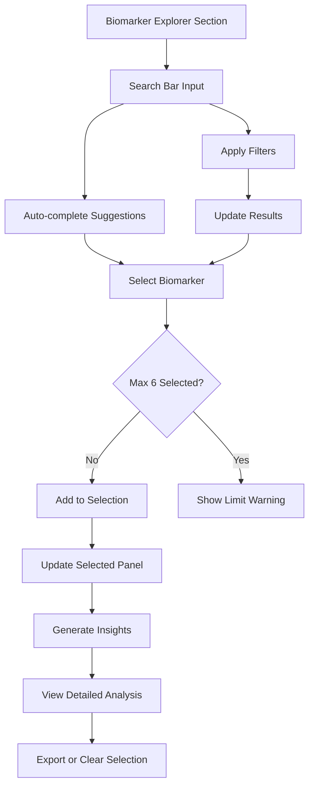

# Biomarker Search Interface - Product Requirements Document

## 1. Product Overview

Replace the overwhelming "All Biomarkers" section that displays 54+ biomarkers simultaneously with an intelligent, search-driven interface that allows users to discover, filter, and analyze specific biomarkers efficiently.

The new interface addresses the current usability issues by providing focused, manageable biomarker exploration with advanced search capabilities, multiple selection functionality, and detailed insights for selected biomarkers only.

This redesign will significantly improve user experience by reducing cognitive load while maintaining comprehensive access to all biomarker data through an intuitive search-first approach.

## 2. Core Features

### 2.1 User Roles
No role distinction required - all users access the same search interface functionality.

### 2.2 Feature Module

Our biomarker search interface consists of the following main components:

1. **Search Interface**: Advanced search bar with real-time filtering, auto-complete suggestions, and intelligent matching
2. **Selection Management**: Multi-select capability with visual feedback and selection limits (maximum 6 biomarkers)
3. **Results Display**: Clean, organized presentation of search results with status indicators and key metrics
4. **Selected Analysis**: Dedicated section showing detailed analysis of chosen biomarkers with comparative insights
5. **Filter Controls**: Category-based filtering options and status-based sorting capabilities

### 2.3 Page Details

| Component | Module Name | Feature Description |
|-----------|-------------|---------------------|
| Search Interface | Search Bar | Real-time search with auto-complete suggestions, fuzzy matching for biomarker names, search history, and clear/reset functionality |
| Search Interface | Auto-complete Dropdown | Dynamic suggestions list with biomarker names, categories, and status indicators, keyboard navigation support |
| Selection Management | Multi-select System | Click-to-select biomarkers with visual feedback, maximum 6 selections enforced, selected items counter, bulk deselect option |
| Selection Management | Selection Indicators | Visual badges on selected biomarkers, selection status in search results, selected biomarkers summary bar |
| Results Display | Search Results Grid | Responsive grid layout showing filtered biomarkers, status color coding, key metrics preview, hover effects |
| Results Display | Biomarker Cards | Compact cards with name, value, unit, status chip, and selection checkbox, optimized for scanning |
| Selected Analysis | Analysis Panel | Detailed view of selected biomarkers with full BiomarkerCard components, comparative analysis, insights generation |
| Selected Analysis | Insights Section | AI-generated insights for selected biomarker combinations, correlation analysis, health implications |
| Filter Controls | Category Filters | Filter by biomarker categories (lipids, blood count, metabolic, etc.), status filters (normal/high/low) |
| Filter Controls | Sort Options | Sort by name, status, value, clinical significance, alphabetical ordering |

## 3. Core Process

**Primary User Flow:**
1. User views the new "Biomarker Explorer" section instead of overwhelming list
2. User types in search bar to find specific biomarkers (e.g., "cholesterol", "glucose")
3. Auto-complete suggestions appear as user types, showing matching biomarkers
4. User selects biomarkers from search results (up to 6 maximum)
5. Selected biomarkers appear in dedicated "Selected for Analysis" section
6. User can refine search, add/remove selections, or apply filters
7. Detailed analysis and insights are generated for selected biomarkers only
8. User can clear selections and start new analysis or export selected data

**Search and Filter Flow:**

## 4. User Interface Design

### 4.1 Design Style

- **Primary Colors**: Emerald (#10b981) for normal values, Red (#ef4444) for high values, Amber (#f59e0b) for low values
- **Secondary Colors**: Slate gray (#64748b) for text, Light gray (#f8fafc) for backgrounds
- **Search Bar Style**: Rounded input field with search icon, clean border, focus states with emerald accent
- **Selection Feedback**: Subtle emerald background for selected items, checkmark icons, selection counter badge
- **Card Design**: Clean white cards with subtle shadows, rounded corners, hover effects with slight elevation
- **Typography**: Inter font family, 16px base size for search, 14px for card content, 18px for section headers
- **Icons**: Lucide React icons for search, filters, selection states, and status indicators
- **Animation**: Smooth transitions for selections, hover effects, and search result updates

### 4.2 Page Design Overview

| Component | Module Name | UI Elements |
|-----------|-------------|-------------|
| Search Interface | Search Bar | Full-width rounded input with search icon, placeholder text "Search biomarkers...", clear button, focus ring in emerald |
| Search Interface | Auto-complete | Dropdown panel below search bar, white background, shadow, biomarker items with status colors, keyboard highlight |
| Selection Management | Selection Counter | Floating badge showing "X of 6 selected", emerald background, positioned top-right of search area |
| Selection Management | Selected Items Bar | Horizontal scrollable list of selected biomarker chips, each with name and remove button |
| Results Display | Search Results | 2-3 column responsive grid on desktop, single column on mobile, gap spacing, smooth animations |
| Results Display | Biomarker Result Cards | Compact cards (200px height) with biomarker name, value, status chip, selection checkbox, hover shadow |
| Selected Analysis | Analysis Panel | Full-width section below search, white background, detailed BiomarkerCard components in grid |
| Selected Analysis | Insights Box | Blue-tinted background panel with AI insights, bullet points, correlation highlights |
| Filter Controls | Filter Bar | Horizontal row of filter chips, category buttons, sort dropdown, clear filters button |

### 4.3 Responsiveness

Desktop-first design with mobile-adaptive layout:
- **Desktop (1024px+)**: 3-column search results grid, horizontal filter bar, side-by-side search and selection counter
- **Tablet (768px-1023px)**: 2-column search results grid, stacked filter controls, full-width search bar
- **Mobile (320px-767px)**: Single column layout, stacked components, touch-optimized selection controls, collapsible filter panel
- **Touch Optimization**: Larger tap targets (44px minimum), swipe gestures for removing selections, pull-to-refresh for search results