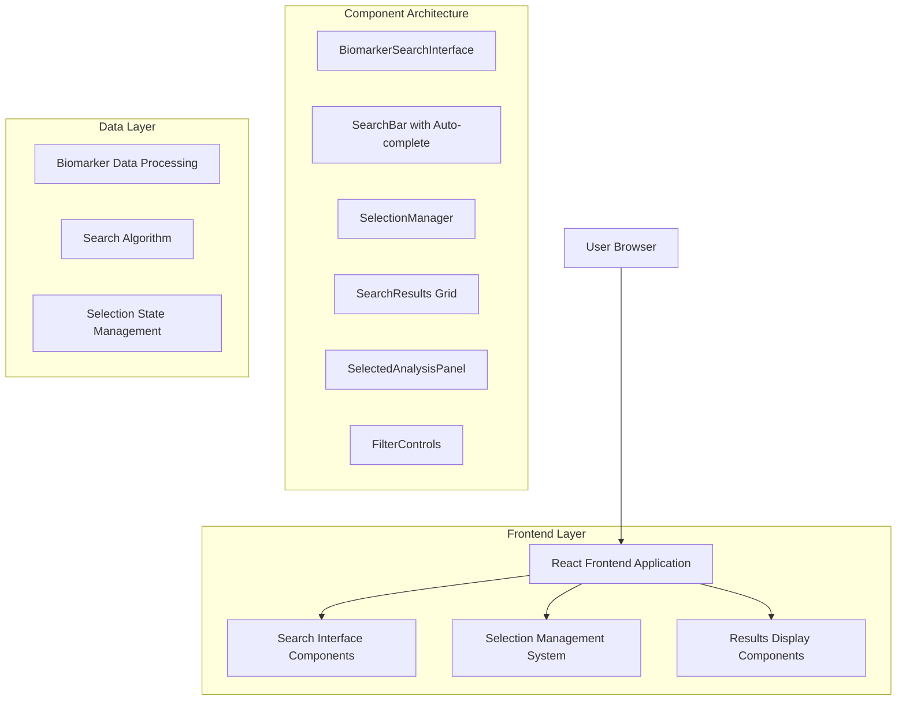

# Biomarker Search Interface - Technical Architecture Document

## 1. Architecture Design



## 2. Technology Description

- **Frontend**: React@18 + TypeScript + Tailwind CSS + Framer Motion
- **State Management**: React useState and useEffect hooks for local component state
- **Search Implementation**: Client-side fuzzy search with Fuse.js library
- **UI Components**: Custom components built on existing design system (BiomarkerCard, StatusChip)
- **Animation**: Framer Motion for smooth transitions and micro-interactions
- **Icons**: Lucide React for consistent iconography

## 3. Route Definitions

No new routes required - this is a component replacement within the existing report page structure.

| Current Section | New Component | Purpose |
|----------------|---------------|---------|
| /report/[id] - All Biomarkers section | BiomarkerSearchInterface | Replace overwhelming biomarker list with search interface |

## 4. Component Architecture

### 4.1 Core Components

**BiomarkerSearchInterface** - Main container component
```typescript
interface BiomarkerSearchInterfaceProps {
  biomarkers: Analyte[];
  onSelectionChange?: (selected: Analyte[]) => void;
}
```

**SearchBar** - Search input with auto-complete
```typescript
interface SearchBarProps {
  biomarkers: Analyte[];
  onSearch: (query: string) => void;
  onSelect: (biomarker: Analyte) => void;
  placeholder?: string;
}
```

**SelectionManager** - Handles multiple biomarker selection
```typescript
interface SelectionManagerProps {
  selectedBiomarkers: Analyte[];
  maxSelections: number;
  onAdd: (biomarker: Analyte) => void;
  onRemove: (biomarker: Analyte) => void;
  onClear: () => void;
}
```

**SearchResults** - Grid display of filtered biomarkers
```typescript
interface SearchResultsProps {
  biomarkers: Analyte[];
  selectedIds: string[];
  onToggleSelection: (biomarker: Analyte) => void;
  isMaxSelected: boolean;
}
```

**SelectedAnalysisPanel** - Detailed view of selected biomarkers
```typescript
interface SelectedAnalysisPanelProps {
  selectedBiomarkers: Analyte[];
  insights?: string[];
}
```

### 4.2 Data Types

```typescript
interface Analyte {
  name: string;
  value: number;
  unit: string;
  ref_low?: number;
  ref_high?: number;
  status: 'normal' | 'high' | 'low' | 'unknown';
  note?: string;
  category?: string;
}

interface SearchState {
  query: string;
  filteredBiomarkers: Analyte[];
  selectedBiomarkers: Analyte[];
  suggestions: Analyte[];
  filters: {
    category?: string;
    status?: string;
    sortBy?: 'name' | 'status' | 'value';
  };
}

interface SelectionLimits {
  maxSelections: 6;
  currentCount: number;
  canAddMore: boolean;
}
```

## 5. Search Algorithm Implementation

### 5.1 Search Strategy

```typescript
// Fuzzy search implementation using Fuse.js
const searchOptions = {
  keys: [
    { name: 'name', weight: 0.7 },
    { name: 'category', weight: 0.3 }
  ],
  threshold: 0.3,
  includeScore: true,
  minMatchCharLength: 2
};

const performSearch = (biomarkers: Analyte[], query: string): Analyte[] => {
  if (!query.trim()) return biomarkers;
  
  const fuse = new Fuse(biomarkers, searchOptions);
  const results = fuse.search(query);
  return results.map(result => result.item);
};
```

### 5.2 Auto-complete Logic

```typescript
const generateSuggestions = (biomarkers: Analyte[], query: string): Analyte[] => {
  if (query.length < 2) return [];
  
  const filtered = performSearch(biomarkers, query);
  return filtered.slice(0, 8); // Limit to 8 suggestions
};
```

## 6. State Management Architecture

### 6.1 Component State Structure

```typescript
const useBiomarkerSearch = (biomarkers: Analyte[]) => {
  const [searchQuery, setSearchQuery] = useState('');
  const [selectedBiomarkers, setSelectedBiomarkers] = useState<Analyte[]>([]);
  const [filteredResults, setFilteredResults] = useState<Analyte[]>(biomarkers);
  const [suggestions, setSuggestions] = useState<Analyte[]>([]);
  const [filters, setFilters] = useState<SearchFilters>({});

  const MAX_SELECTIONS = 6;

  const handleSearch = useCallback((query: string) => {
    setSearchQuery(query);
    const results = performSearch(biomarkers, query);
    setFilteredResults(results);
    setSuggestions(generateSuggestions(biomarkers, query));
  }, [biomarkers]);

  const handleSelection = useCallback((biomarker: Analyte) => {
    if (selectedBiomarkers.length >= MAX_SELECTIONS) return;
    
    setSelectedBiomarkers(prev => {
      if (prev.find(b => b.name === biomarker.name)) return prev;
      return [...prev, biomarker];
    });
  }, [selectedBiomarkers]);

  const handleDeselection = useCallback((biomarker: Analyte) => {
    setSelectedBiomarkers(prev => 
      prev.filter(b => b.name !== biomarker.name)
    );
  }, []);

  return {
    searchQuery,
    selectedBiomarkers,
    filteredResults,
    suggestions,
    filters,
    handleSearch,
    handleSelection,
    handleDeselection,
    canAddMore: selectedBiomarkers.length < MAX_SELECTIONS
  };
};
```

## 7. Performance Optimizations

### 7.1 Search Performance

- **Debounced Search**: 300ms delay to prevent excessive API calls
- **Memoized Results**: Cache search results for repeated queries
- **Virtual Scrolling**: For large result sets (if needed)
- **Lazy Loading**: Load biomarker details on demand

### 7.2 Rendering Optimizations

```typescript
// Memoized search results to prevent unnecessary re-renders
const MemoizedSearchResults = React.memo(SearchResults);

// Debounced search hook
const useDebouncedSearch = (callback: Function, delay: number) => {
  const debouncedCallback = useCallback(
    debounce(callback, delay),
    [callback, delay]
  );
  return debouncedCallback;
};
```

## 8. Accessibility Features

### 8.1 Keyboard Navigation

- **Tab Navigation**: Full keyboard accessibility through all interactive elements
- **Arrow Keys**: Navigate through auto-complete suggestions
- **Enter/Space**: Select biomarkers and activate buttons
- **Escape**: Close auto-complete dropdown and clear search

### 8.2 Screen Reader Support

```typescript
// ARIA labels and roles for accessibility
<div role="combobox" aria-expanded={showSuggestions} aria-haspopup="listbox">
  <input
    aria-label="Search biomarkers"
    aria-describedby="search-instructions"
    aria-autocomplete="list"
  />
</div>

<ul role="listbox" aria-label="Biomarker suggestions">
  {suggestions.map(biomarker => (
    <li role="option" aria-selected={isSelected}>
      {biomarker.name}
    </li>
  ))}
</ul>
```

### 8.3 Visual Accessibility

- **High Contrast**: Ensure 4.5:1 contrast ratio for all text
- **Focus Indicators**: Clear focus rings on all interactive elements
- **Color Independence**: Status information not solely dependent on color
- **Text Scaling**: Support for 200% text zoom without horizontal scrolling