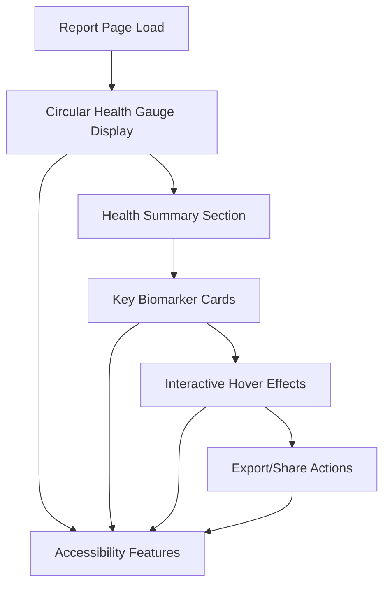

# Health Report Interface Redesign - Product Requirements Document

## 1. Product Overview

A comprehensive redesign of the health report generation interface that transforms complex blood test data into an intuitive, visually engaging experience centered around a prominent circular health score gauge. The redesigned interface prioritizes clarity, accessibility, and user engagement through modern UI patterns and interactive elements.

The primary goal is to help users quickly understand their overall health status while providing detailed insights into key biomarkers through an enhanced visual hierarchy and improved user experience.

## 2. Core Features

### 2.1 User Roles

| Role | Registration Method | Core Permissions |
|------|---------------------|------------------|
| Patient/User | Email registration or guest access | Can upload lab results, view reports, export/share reports |
| Healthcare Provider | Professional verification | Can access patient reports (with permission), provide annotations |

### 2.2 Feature Module

Our health report interface redesign consists of the following main components:

1. **Health Score Dashboard**: Prominent circular gauge display, overall health summary, key metrics overview
2. **Detailed Results Section**: Individual biomarker cards, visual indicators, clinical significance ratings
3. **Interactive Elements**: Hover effects, micro-animations, accessibility controls
4. **Export & Sharing**: Print-friendly layouts, shareable links, PDF generation

### 2.3 Page Details

| Page Name | Module Name | Feature description |
|-----------|-------------|---------------------|
| Health Score Dashboard | Circular Health Gauge | Display prominent 200px diameter circular gauge showing overall health score (0-100) with smooth animations, color-coded segments, and hover effects with subtle shading |
| Health Score Dashboard | Health Summary Section | Present concise 3-4 sentence summary highlighting key findings from blood test analysis, positioned directly below the gauge |
| Health Score Dashboard | Key Metrics Overview | Show 4 summary cards displaying normal/high/low/unknown value counts with trend indicators |
| Detailed Results Section | Biomarker Cards | Display 5-6 most clinically significant blood test values in card format with current measurement, normal range, and visual deviation indicators |
| Detailed Results Section | Visual Indicators | Implement horizontal bar charts showing value position relative to normal range with color-coded segments (amber for low, green for normal, red for high) |
| Interactive Elements | Hover Effects | Apply subtle shading and shine effects to gauge, cards, and actionable elements with 300ms transition duration |
| Interactive Elements | Micro-interactions | Add gentle pulsing animations for attention indicators and smooth state transitions |
| Export & Sharing | Action Controls | Provide print, share, and export functionality with accessible button designs and keyboard navigation support |

## 3. Core Process

**Primary User Flow:**
1. User accesses health report page after lab analysis completion
2. Page loads with prominent circular health score gauge as focal point
3. User views overall health summary immediately below gauge
4. User scrolls to examine detailed biomarker cards with visual indicators
5. User interacts with hover effects on gauge and cards for enhanced feedback
6. User can export, print, or share report using action controls

**Accessibility Flow:**
1. Screen reader users receive proper ARIA labels for all interactive elements
2. Keyboard users can navigate through all interactive components using tab navigation
3. Visual indicators include text alternatives for users with visual impairments
4. High contrast mode support ensures 4.5:1 minimum contrast ratio

## 4. User Interface Design

### 4.1 Design Style

- **Primary Colors**: Emerald green (#10b981) for normal values, amber (#f59e0b) for low values, red (#ef4444) for high values
- **Secondary Colors**: Slate gray (#64748b) for text, light gray (#f1f5f9) for backgrounds
- **Button Style**: Rounded corners (12px radius), subtle shadows, smooth hover transitions with shading effects
- **Typography**: System font stack with clear hierarchy - headings in 24-32px, body text in 16px, labels in 14px
- **Layout Style**: Card-based design with generous white space (24px margins), centered content with max-width constraints
- **Animation Style**: Subtle micro-interactions with 300ms ease-in-out transitions, gentle pulsing for attention indicators

### 4.2 Page Design Overview

| Page Name | Module Name | UI Elements |
|-----------|-------------|-------------|
| Health Score Dashboard | Circular Health Gauge | 200px diameter SVG circle with gradient fill, animated progress arc, centered score text (48px bold), subtle drop shadow and hover glow effect |
| Health Score Dashboard | Health Summary | Clean typography with 18px line height, emerald accent color for key terms, contained within rounded card with light background |
| Detailed Results Section | Biomarker Cards | White background cards with 1px border, 16px padding, rounded corners, hover shadow elevation, responsive grid layout (1-2 columns) |
| Detailed Results Section | Visual Indicators | Horizontal progress bars with gradient backgrounds, positioned value markers, smooth fill animations on load |
| Interactive Elements | Hover States | Subtle box-shadow increase, slight scale transform (1.02x), gentle shine overlay effect using CSS gradients |

### 4.3 Responsiveness

The interface follows a mobile-first approach with breakpoints at 320px (mobile), 768px (tablet), and 1024px (desktop). The circular gauge scales proportionally on smaller screens (minimum 150px diameter), and the biomarker cards stack vertically on mobile devices. Touch interaction optimization includes larger tap targets (minimum 44px) and appropriate spacing for finger navigation.

## 5. Technical Considerations

### 5.1 Performance Requirements

- Initial page load under 2 seconds
- Smooth 60fps animations for all interactive elements
- Optimized SVG rendering for the circular gauge
- Lazy loading for non-critical visual elements

### 5.2 Accessibility Standards

- WCAG 2.1 AA compliance
- Screen reader compatibility with semantic HTML
- Keyboard navigation support for all interactive elements
- High contrast mode support
- Alternative text for all visual indicators

### 5.3 Browser Compatibility

- Modern browsers (Chrome 90+, Firefox 88+, Safari 14+, Edge 90+)
- Progressive enhancement for older browsers
- CSS Grid and Flexbox support required
- SVG animation support for gauge functionality