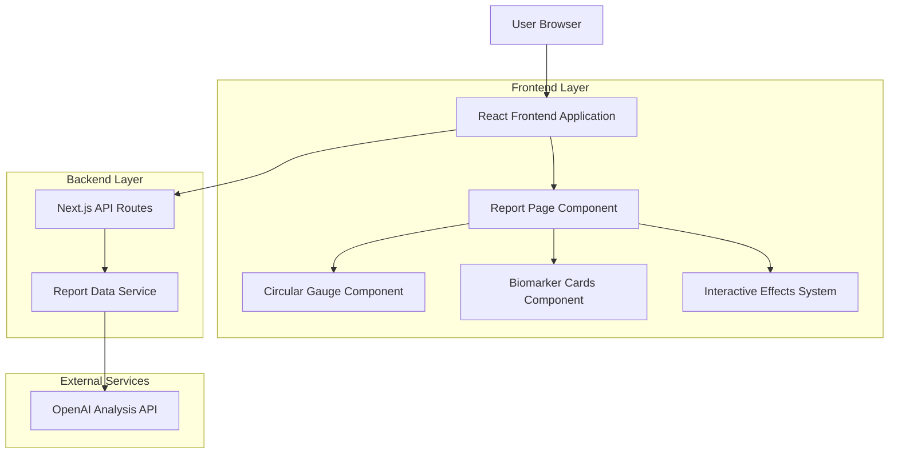
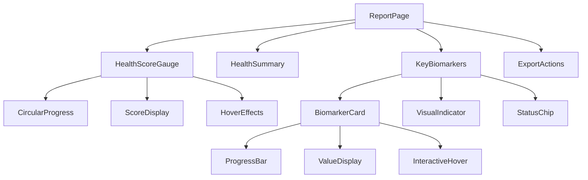
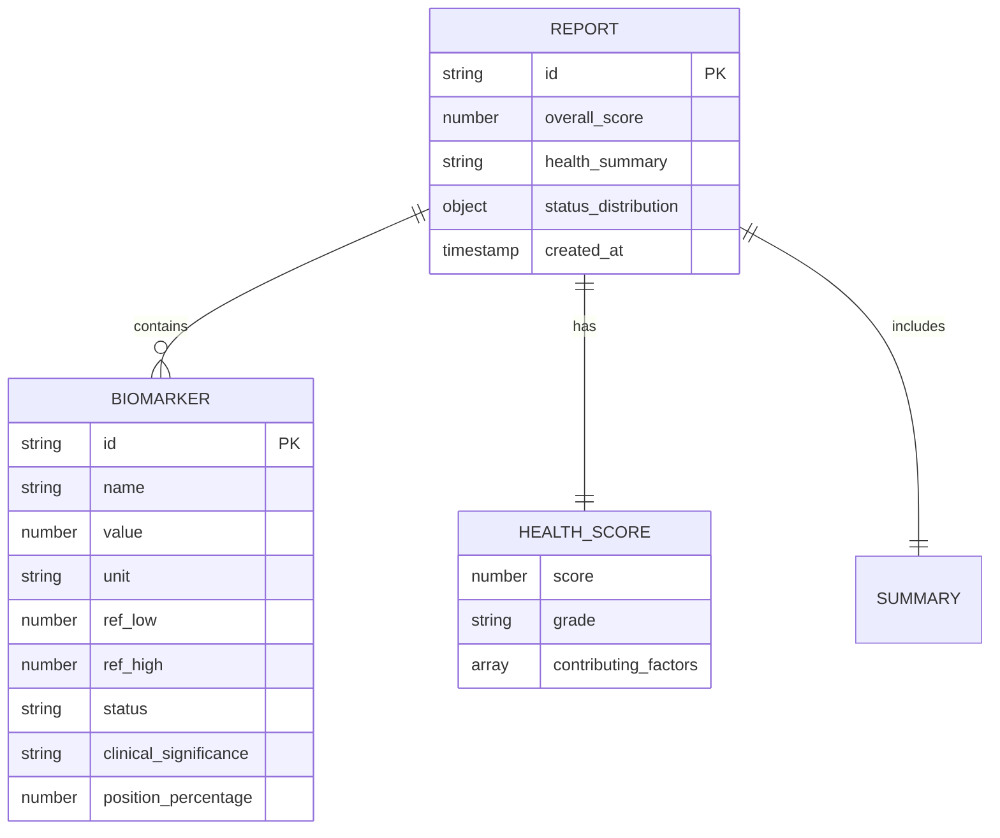

# Health Report Interface Redesign - Technical Architecture Document

## 1. Architecture Design



## 2. Technology Description

- Frontend: React@19 + Next.js@15 + TypeScript + Tailwind CSS@4
- Animation: Framer Motion for smooth transitions and micro-interactions
- Charts: Custom SVG components for circular gauge and progress bars
- Icons: Lucide React for consistent iconography
- Backend: Next.js API routes with existing OpenAI integration

## 3. Route Definitions

| Route | Purpose |
|-------|---------|
| /report/[id] | Enhanced health report page with redesigned interface |
| /api/report/[id] | Fetch report data with optimized payload for new UI |
| /api/report/[id]/export | Generate PDF export of redesigned report |

## 4. API Definitions

### 4.1 Core API

Enhanced report data retrieval
```
GET /api/report/[id]
```

Response includes optimized data structure:
| Param Name | Param Type | Description |
|-----------|-------------|-------------|
| overall_score | number | Health score 0-100 for circular gauge |
| health_summary | string | Concise 3-4 sentence summary |
| key_biomarkers | array | Top 5-6 most significant values |
| visual_indicators | object | Data for progress bars and status indicators |

Example Response:
```json
{
  "overall_score": 75,
  "health_summary": "Your blood test results show generally healthy levels with a few areas for attention. Cholesterol levels are within normal range, indicating good cardiovascular health. Blood sugar levels are slightly elevated and may benefit from dietary adjustments. Overall immune system markers appear strong.",
  "key_biomarkers": [
    {
      "name": "LDL Cholesterol",
      "value": 95,
      "unit": "mg/dL",
      "ref_low": 0,
      "ref_high": 100,
      "status": "normal",
      "clinical_significance": "high",
      "position_percentage": 95
    }
  ],
  "status_distribution": {
    "normal": 4,
    "high": 1,
    "low": 1,
    "unknown": 0
  }
}
```

## 5. Component Architecture

### 5.1 Component Hierarchy



### 5.2 Key Components

**HealthScoreGauge Component**
- SVG-based circular progress indicator
- Animated score counting on mount
- Hover effects with glow and scale
- Responsive sizing (200px desktop, 150px mobile)

**BiomarkerCard Component**
- Card layout with hover elevation
- Integrated progress bar visualization
- Status indicator with color coding
- Accessible keyboard navigation

**InteractiveEffects System**
- CSS-in-JS hover animations
- Framer Motion for smooth transitions
- Performance-optimized transforms
- Touch-friendly mobile interactions

## 6. Data Model

### 6.1 Enhanced Report Data Structure



### 6.2 Frontend State Management

**Report State Interface**
```typescript
interface ReportState {
  report: EnhancedReport | null;
  loading: boolean;
  error: string | null;
  interactionState: {
    hoveredElement: string | null;
    animationComplete: boolean;
  };
}

interface EnhancedReport {
  id: string;
  overall_score: number;
  health_summary: string;
  key_biomarkers: Biomarker[];
  status_distribution: StatusDistribution;
  created_at: string;
}

interface Biomarker {
  name: string;
  value: number;
  unit: string;
  ref_low: number;
  ref_high: number;
  status: 'normal' | 'high' | 'low' | 'unknown';
  clinical_significance: 'high' | 'medium' | 'low';
  position_percentage: number;
  note: string;
}
```

## 7. Performance Optimization

### 7.1 Rendering Strategy

- React.memo for biomarker cards to prevent unnecessary re-renders
- Virtualization for large biomarker lists (if >10 items)
- CSS transforms for animations to leverage GPU acceleration
- Debounced hover effects to prevent excessive state updates

### 7.2 Loading Strategy

- Skeleton loading states for all major components
- Progressive enhancement of interactive features
- Lazy loading of non-critical animations
- Optimized SVG rendering with viewBox scaling

## 8. Accessibility Implementation

### 8.1 ARIA Labels and Roles

```typescript
// Circular gauge accessibility
<div 
  role="progressbar" 
  aria-valuenow={score} 
  aria-valuemin={0} 
  aria-valuemax={100}
  aria-label={`Overall health score: ${score} out of 100`}
>

// Biomarker cards
<div 
  role="article" 
  aria-labelledby={`biomarker-${id}-title`}
  tabIndex={0}
>
```

### 8.2 Keyboard Navigation

- Tab order: Health gauge → Summary → Biomarker cards → Export actions
- Enter/Space activation for interactive elements
- Escape key to dismiss hover states
- Arrow keys for navigating between biomarker cards

## 9. Animation Framework

### 9.1 Framer Motion Configuration

```typescript
const gaugeVariants = {
  initial: { scale: 0.8, opacity: 0 },
  animate: { 
    scale: 1, 
    opacity: 1,
    transition: { duration: 0.6, ease: "easeOut" }
  },
  hover: {
    scale: 1.05,
    boxShadow: "0 20px 40px rgba(16, 185, 129, 0.2)",
    transition: { duration: 0.3 }
  }
};

const cardVariants = {
  hover: {
    y: -4,
    boxShadow: "0 12px 24px rgba(0, 0, 0, 0.1)",
    transition: { duration: 0.2 }
  }
};
```

### 9.2 CSS Custom Properties for Theming

```css
:root {
  --gauge-primary: #10b981;
  --gauge-secondary: #34d399;
  --hover-shadow: 0 8px 32px rgba(16, 185, 129, 0.15);
  --transition-smooth: all 0.3s cubic-bezier(0.4, 0, 0.2, 1);
}
```